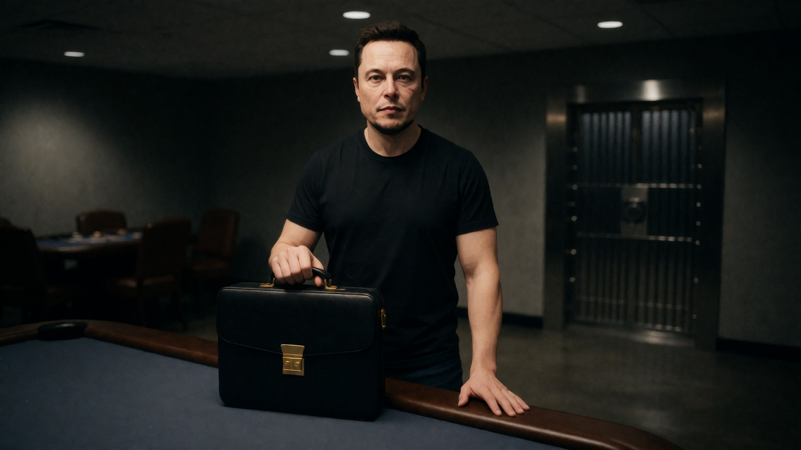
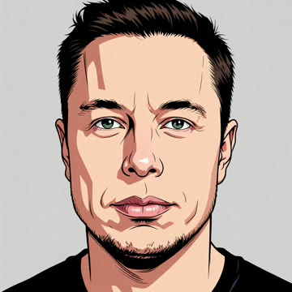
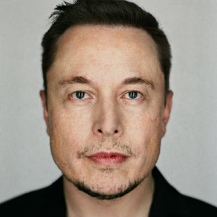
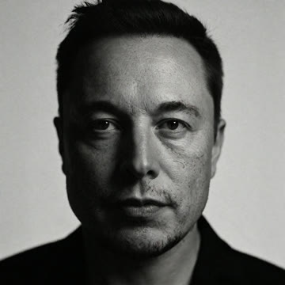
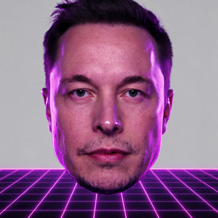
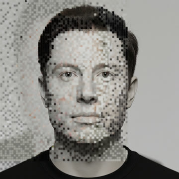

# 🎬 Split Node

<div align="center">


[](https://python.org)
[](https://lmstudio.ai)
[](https://comfyanonymous.github.io/ComfyUI_examples/)
[](https://github.com/Kyutai-Labs/pocket-tts)
[](https://ffmpeg.org)
[]()

## ❤️ Support This Project

<a href="https://www.buymeacoffee.com/drgekoz" target="_blank"></a>



**An AI documentary generator. Turns "beat the system" news stories (hacks, lottery wins, loopholes, scams) into ~25-minute cinematic documentaries in the FERN / Black Files style — with LLM-written narration, a consistent AI cast, stylized locations and props, voice-cloned narration, cinematic music and SFX, and burned-in chapter cards. Headless: RSS in, rendered and uploaded episode out.**

[The Pipeline](#the-pipeline) · [The Look](#-the-look) · [Supported Models](#supported-models--apis) · [Real-World Cost](#real-world-cost) · [Getting Started](#getting-started) · [Features](#features)

</div>

## 🎥 Example Output

<p align="center">
  <a href="https://github.com/DrGekoz/split-node">
    
  </a>
</p>

Every episode is a full documentary: a locked story bible, an AI cast with consistent faces, stylized worlds, voice-cloned narration, music, SFX, and 10 duration-aligned chapters — rendered headless and uploaded automatically.

---

> **Status:** This pipeline runs **fully locally on an RTX 3070** (Krea 2 Turbo in ComfyUI, LM Studio, PocketTTS) — no per-video cloud bills. The only paid external dependency is a **SerpAPI** key for real-photo references and trend scoring (~$0.01/query). 1080p and 4K output.

---

## What is Split Node?

Split Node automates the entire documentary production workflow using AI. Feed it an RSS "beat the system" story (or a URL), and it handles everything: researching the story, building a director's bible, planning a ~25-minute narration script, writing a shot list with camera logic, generating a consistent AI cast with six identity-locked reference panels per character, building stylized locations and props, rendering every shot to 1080p or 4K, voice-cloning the narration, composing music, aligning SFX, burning in chapter cards, and uploading the finished episode to YouTube + Discord.

Built for **content creators, documentary-makers, and automated channel operators** who want to ship a cinematic, character-consistent AI documentary — end to end — without touching a video editor.

> **I built this as a fully headless personal pipeline** — no UI, just `RSS in → rendered and uploaded episode out`. Every stage is resume-safe, every image is face-locked and angle-aware, and every episode is written fresh from the article (no template reuse).

---

## 🧠 How a tiny local model writes the whole script

Split Node is deliberately engineered to do **all of the LLM work on a small local model** — it currently runs the entire pipeline on **Gemma 4 (7.5B) at a 12,222-token context window** in LM Studio. No giant context, no huge model, no cloud LLM bills. The secret is that the pipeline never asks the model to hold the whole episode in its head at once. Instead it **chunks the work and injects exactly the context each step needs** — so a 7.5B model comfortably produces a full ~25-minute documentary script, beat by beat.

Here's the injection architecture that makes that possible:

- **📰 RSS feed injection (story discovery)** — instead of asking the model "what should I make a video about?", the pipeline pulls *real* stories from RSS feeds (hacker / lottery / loophole / AI / tech) plus Hacker News Algolia search. Each candidate article is passed to the LLM to be **relevance-scored 0–10 against the niche**; off-topic beats are discarded before they ever reach the script stage. The model is never generating topics from thin air — it's *filtering and judging* curated input, which is far easier and cheaper than generating.

- **📃 Paragraph injection (narration script)** — the biggest win. The pipeline does **not** hand the model a full article and ask for a script. It splits the article into paragraphs and, for **each** paragraph, injects a tight sliding window (that paragraph plus its neighbours) as `STORY CONTEXT`, then asks for exactly N narration paragraphs. So at any moment the model only holds **~3 paragraphs of source material**, not a whole article. A 7.5B model easily expands a single paragraph into cinematic narration — and it scales to arbitrarily long episodes because the context window never grows.

- **🚫 Covered-beat dedupe injection** — alongside each window, the pipeline injects a short `ALREADY COVERED in earlier narration - do NOT repeat these beats` list (the last couple of beats it already wrote). This stops the small model from looping or repeating ideas across paragraphs, which is the classic failure mode of small-context generation.

- **🎨 Style injection (images)** — every image prompt (shots, character panels, locations, props) gets the selected **style profile injected as plain text** — e.g. `arcane`, `noir`, `mannequin`, or your own custom descriptor. There are **no style image refs and no LoRA training**, so the visual look is driven by a single text string that any image model understands. That's what lets 9 built-in looks (plus unlimited custom ones) exist with zero retraining.

- **🎬 Prompt injection for everything else** — each LLM pass (director's bible, episode world, scene board, shot list, chapter titles, brand extraction) is a **focused single-purpose prompt** with only the data it needs. The shot list, for example, is built one beat at a time with camera logic injected as structured constraints (EWS/WS/MS/CU/ECU, angles, facing, SFX). No stage sees more context than it can chew.

The result: **a 7.5B local model writes the entire ~25-minute documentary script** — bible, narration, shot list, chapters — because the pipeline is doing the hard orchestration (chunking, windowing, deduping, scoring) and the model is only ever asked to do one small, well-scoped creative task at a time.

---

## 💸 Run it for free on 8GB VRAM

Here's the part that separates Split Node from the other "content machine" tools out there:

- **Images are 100% free and local.** Krea 2 Turbo (or Z-Image) runs in ComfyUI on a **single RTX 3070 8GB** card — no per-image cloud bill. Every shot, character panel, location and prop is generated on your own GPU. The only cloud cost in the whole image pipeline is **SerpAPI at ~$0.01/query** for real-photo references (and it's cached — logos from Wikimedia cost nothing, and real-photo refs are reused).
- **The LLM is free and local.** LM Studio + a 7.5B model on 12K context writes the entire script. No tokens, no API key, no rate limits.
- **Voice is free and local.** PocketTTS voice-clones the narrator on your own GPU (or use a built-in catalog voice).
- **Music, SFX and rendering are free and local.** One continuous music bed, 130+ hit-aligned SFX, and FFmpeg `hevc_nvenc` output to 1080p/4K — all on your machine.

So a full episode costs **basically nothing** — just the handful of SerpAPI queries for real-photo references (a few dollars worst case, often less).

**The only thing a low-end PC can't do locally is video generation.** AI image-to-video (Hailuo, Veo, Kling, LTX — via RunPod or fal.ai) needs a beefy GPU that most machines don't have. Split Node handles this gracefully: **on 8GB+ VRAM you can run the whole thing end-to-end for free**, and on a weaker PC the only external overhead is the optional video-clip step (~$0.23/clip via RunPod). You can even **skip AI video entirely** — Split Node's documentary style renders still shots with motion, music and SFX, so a fully cinematic episode still works without any video-generation API.

> **Bottom line:** one 8GB GPU = a completely free, self-contained documentary channel (images + script + voice + music + render + upload). The moment you add video generation, it's the *only* paid step — and it's optional. That's a lower overhead than any of the other "content machine" pipelines, most of which charge per image, per token, and per clip.

---

## The Pipeline

Split Node runs a step-by-step pipeline. Every stage is resume-safe — crash, restart, and it picks up exactly where it left off (it never re-uploads a finished video).

```
RSS / URL story
    │
    ▼
┌──────────────────────────────────────────────────────────┐
│  1. STORY DISCOVERY                                     │
│     RSS "beat the system" feed → article → junk filter   │
│     → LLM relevance scoring (0-10, off-topic discarded)  │
│     Trend scorer (SerpAPI + YouTube) ranks topic demand  │
└──────────────────────────────────────────────────────────┘
    │
    ▼
┌──────────────────────────────────────────────────────────┐
│  2. SCRIPT GENERATION (4 LLM passes)                     │
│     Director's bible → episode world → scene board        │
│     → narration script (~115 paras / ~25 min) → shot list │
│     (EWS/WS/MS/CU/ECU + angles) + 10 chapter breaks      │
│     Human review gate on the Krea 2 test frame            │
└──────────────────────────────────────────────────────────┘
    │
    ▼
┌──────────────────────────────────────────────────────────┐
│  3. CAST & LIKENESS                                      │
│     20 metahuman archetypes; real-photo reference search  │
│     (SerpAPI + Openverse) + local vision audit            │
│     → SIX 1280x1280 identity panels per character         │
└──────────────────────────────────────────────────────────┘
    │
    ▼
┌──────────────────────────────────────────────────────────┐
│  4. LOCATIONS, PROPS & BRAND LOGOS                       │
│     6-panel location sheets per place · front+back props  │
│     Real brand logos (Wikimedia + SerpAPI) baked in       │
└──────────────────────────────────────────────────────────┘
    │
    ▼
┌──────────────────────────────────────────────────────────┐
│  5. FROM PANEL TO SCREEN                                 │
│     Per-shot smart ref selection (wide→body, close→face,  │
│     side→mirror, back→back) → Krea 2 render at 1080p/4K   │
│     in parallel with TTS                                  │
└──────────────────────────────────────────────────────────┘
    │
    ▼
┌──────────────────────────────────────────────────────────┐
│  6. VOICE, MUSIC & SFX                                   │
│     PocketTTS cloned narration (parallel) · one music bed │
│     (suspense→triumphant) · 130+ hit-aligned SFX          │
└──────────────────────────────────────────────────────────┘
    │
    ▼
┌──────────────────────────────────────────────────────────┐
│  7. RENDER & TITLES                                      │
│     hevc_nvenc concat · burned-in chapter cards           │
│     + typewriter location/person cards (ASS engine)       │
└──────────────────────────────────────────────────────────┘
    │
    ▼
┌──────────────────────────────────────────────────────────┐
│  8. UPLOAD                                              │
│     YouTube (native scheduling) + Discord announcement    │
└──────────────────────────────────────────────────────────┘
```

### 🎨 The Look

The channel style is a selectable **style profile** — a plain-text descriptor injected into every prompt (shots, character panels, locations, props). No style image refs, no LoRA training, no reference-copy bug.

Pick a built-in with the `STYLE` env var, or add your own:

```
STYLE=arcane python system_breakers.py          # default channel look
STYLE=bold-outline python system_breakers.py
STYLE=noir python system_breakers.py
python system_breakers.py --list-styles          # show every selectable style
python system_breakers.py --add-style vhs "<style descriptor text>"   # add + persist
python system_breakers.py --remove-style vhs     # remove a custom style
```

Built-ins: `arcane` (default), `bold-outline`, `artsy`, `photoreal`, `noir`, `synthwave`, `editorial`, `watercolor`, `mannequin`. Custom styles persist in `style_sheets/custom_styles.json` and become selectable on every future run. A resume keeps the exact style the episode was generated with (unless you override with `STYLE=`).

**See the look** — every built-in style, previewed on the same face (Elon Musk — real-photo identity ref + that style injected) so you can compare before you pick:

| 🎨 **Arcane** *(default)* | ✏️ **Bold outline** | 🎭 **Artsy** |
|---|---|---|
|  |  |  |

| 📷 **Photoreal** | 🌑 **Noir** | 🌆 **Synthwave** |
|---|---|---|
|  |  |  |

| 🗞️ **Editorial** | 🎨 **Watercolor** | 🧍 **Mannequin** |
|---|---|---|
|  |  |  |

> 🧍 **Mannequin look:** unlike the other styles, the mannequin style is engineered for **high prompt adherence over identity transfer** — the porcelain face is *fully prompt-controlled* (blank glossy head, no eyes/nose/mouth, no human features) and the **only** trait carried over from the real-person reference is their **hair** (same cut, colour and texture). It runs in Krea reference mode (not identity mode) with a low ref-boost so the prompt wins over the reference, which is exactly what makes it read as a mannequin rather than the person.

> 💡 **Want your own look?** The style is just plain text injected into every prompt — so add your own and it becomes a first-class option on every future run:
> ```
> python system_breakers.py --add-style vhs "grainy 90s VHS camcorder, scanlines, oversaturated, handheld"
> python system_breakers.py --list-styles     # 'vhs' now appears in the list
> STYLE=vhs python system_breakers.py          # and is selectable like the built-ins
> ```

---

## Supported Models & APIs

> **Note:** Split Node can render every image and video through **three interchangeable backends** — local (ComfyUI), RunPod, or fal.ai — selected per run with `IMAGE_BACKEND` / `VIDEO_BACKEND`. Defaults to fully local. Cloud backends need a `RUNPOD_API_KEY` / `FAL_API_KEY` in `.env`.

| Selection | Values |
|---|---|
| `IMAGE_BACKEND` | `local` *(default)* · `runpod` · `fal` |
| `IMAGE_MODEL` | see table below (per backend) |
| `VIDEO_BACKEND` | `runpod` · `fal` · `local` |
| `VIDEO_MODEL` | see table below (per backend) |

```bash
IMAGE_BACKEND=runpod python system_breakers.py        # shots via RunPod z-image-turbo
IMAGE_BACKEND=fal IMAGE_MODEL=flux-dev python system_breakers.py
VIDEO_BACKEND=runpod VIDEO_MODEL=veo3-1-fast python system_breakers.py
python providers.py --list-images   # show every image backend/model
python providers.py --list-videos   # show every video backend/model
```

> **Note:** local rendering needs ComfyUI + the Krea 2 / Z-Image models. `comfy_manager.py` auto-starts ComfyUI and downloads any missing model files. Cloud backends ignore character/location ref panels (text-to-image) but need no local GPU.

### Image models

| Backend | Model | Notes |
|---|---|---|
| **local** *(ComfyUI)* | `krea2-turbo` *(default)*, `z-image-turbo` | Krea 2 Turbo FP8 + 4x-FaceUpDAT upscale; supports identity panels |
| **runpod** | `z-image-turbo` *(default)*, `nano-banana-2` (edit) | Serverless, async /run + poll; ~$0.005/image |
| **fal** | `flux-schnell` *(default)*, `flux-dev`, `nano-banana-2`, `z-image-turbo` | Sync /fal.run; ~$0.003–0.06/image |

### Video models

| Backend | Model | Notes |
|---|---|---|
| **runpod** | `hailuo-02-std` *(default)*, `hailuo-2-3-fast`, `veo3-1-fast` (i2v), `p-video` | Serverless async; ~$0.23/clip |
| **fal** | `runway-gen3`, `veo3-1`, `minimax-hailuo` | Sync endpoint |
| **local** | `comfyui` | Requires a ComfyUI video workflow/model installed |

### LLM — Story, Scripts, Shot Lists, Metadata

| Provider | Models / Notes |
|---|---|
| **LM Studio** *(local)* | Any local model on `localhost:1234` (e.g. Gemma) — runs the director's bible, narration script, shot list, chapter titles, brand extraction, and relevance scoring |
| **Local vision** | Same LM Studio instance — audits real-photo references (person + text/logo/watermark) and extracts the style descriptor from style sheets |

### Image Generation

| Provider | Model | Notes |
|---|---|---|
| **ComfyUI** *(local)* | **Krea 2 Turbo** | Runs on RTX 3070 with `--lowvram`, 8-step Turbo at ~3s/it. Renders character panels, location sheets, props, brand assets, and every shot |
| **In-graph upscale** | **4x-FaceUpDAT** | Every panel/shot upscaled in-graph to the selected output resolution |
| **SerpAPI** *(cloud, ~$0.01/query)* | Google Images | Finds real-photo references for real-world subjects and specific props (Openverse fallback) |
| **Wikimedia Commons** | 36 pre-mapped brands | Official brand logos (rasterized PNG), no search needed |

### Voice / TTS

| Provider | Capability |
|---|---|
| **PocketTTS** *(local, CUDA)* | Cloned narration voice (built-in or a cloned `.wav` ref), loudnorm 0dB, generated in parallel with image generation |

### Music & SFX

| Provider | Capability |
|---|---|
| **Local** | One continuous music bed (suspense crossfading into triumphant, -18dB) composed to fit the exact video length |
| **SFX library** | 130+ cinematic sounds (Nikko Hunt) with pre-analyzed build/hit/decay times, hit-aligned at -14dB; camera shutter at -4dB |

### Video

| Provider | Capability |
|---|---|
| **FFmpeg** *(local)* | hevc_nvenc stream-copy concat, `+faststart`, 1080p or 4K; chapter cards + typewriter titles burned in via the ASS engine |

---

## Real-World Cost

> Because the heavy lifting runs **locally on your own GPU**, a full ~25-minute episode costs almost nothing — just the SerpAPI queries for real-photo references and the small YouTube API usage for upload.

| Component | Provider | Notes |
|---|---|---|
| Story + Scripts + Shot List | LM Studio (local) | Free |
| Images (panels, shots, upscale) | ComfyUI Krea 2 (local) | Free — GPU time only |
| Narration TTS | PocketTTS (local, CUDA) | Free |
| Music & SFX | Local | Free |
| Real-photo references + trend scoring | SerpAPI | ~$0.01/query (a few dollars per episode worst case) |
| Upload | YouTube Data API | Free quota |

**Tips to reduce cost:** run everything locally (already the default), and cache brand logos (Wikimedia) + real-photo refs so repeat searches never happen.

---

## Getting Started

### Prerequisites

- **Python 3.11+**
- **LM Studio** on `localhost:1234` (LLM + vision)
- **ComfyUI** with **Krea 2 Turbo** (default local backend — `comfy_manager.py` auto-starts it + downloads models)
- **PocketTTS** server on `127.0.0.1:8769`
- **FFmpeg** with `hevc_nvenc` (NVIDIA)
- A **SerpAPI** key for real-photo references + trend scoring
- *(optional, cloud backends)* **RunPod** and/or **fal.ai** API keys for `IMAGE_BACKEND` / `VIDEO_BACKEND`

### Install & Run

```bash
# Clone
git clone https://github.com/DrGekoz/split-node
cd split-node

# Set API keys in .env (never commit)
# SERPAPI_API_KEY=...
# YouTube OAuth: client_secret_*.json + oauth_split_node.py

# Run the full pipeline (story → upload)
SystemBreakers.bat
# or
python system_breakers.py
```

### Common Commands

| Command | Purpose |
|---|---|
| `python system_breakers.py --list-styles` | List every selectable style profile |
| `python system_breakers.py --add-style vhs "<desc>"` | Add a custom style (persists) |
| `STYLE=noir python system_breakers.py` | Generate with a selected style profile |
| `RESOLUTION=4k python system_breakers.py` | Render at 4K (image upscale + final video); default 1080p |
| `EASTER_EGG="duck pope" python system_breakers.py` | Hide an easter egg in one shot, no prompt |
| `python system_breakers.py --cache-logos OpenAI Claude` | Pre-cache brand logos without a full run |
| `python oauth_split_node.py` | YouTube OAuth authorization |

---

## Project Structure

```
split-node/
├── system_breakers.py          Main pipeline script (all 8 stages)
├── krea2_splitnode.py          Local Krea 2 Turbo image generation (ComfyUI)
├── providers.py                Unified image/video backends: local, RunPod, fal.ai
├── comfy_manager.py            Auto-start ComfyUI, download models, run workflows
├── cast_likeness.py            Build cast likeness references
├── split_node_titles.py        Chapter / title ASS engine
├── analyze_sfx.py              Analyze SFX library (build/hit/decay)
├── trend_scorer.py             Score topic ideas (demand/room/trajectory)
├── upscale_4k.py               Optional standalone SPAN 4x upscaler
├── mini_test.py                End-to-end pipeline test
│
├── style_sheets/               Style profiles + custom_styles.json + easter_eggs.json
├── style_previews/             One 1280x1280 preview panel per selectable style
├── cast_refs/                  Cast likeness images (real/ + logos/ gitignored)
├── cinematic_sounds/           SFX library
├── docs/images/                README showcase images
├── voice_refs/                 TTS narration voice clone reference
│
├── shots/                      Per-episode shot folders (epN/) — gitignored
├── rendered_audio/             Generated narration — gitignored
├── rendered_video/             Rendered episodes — gitignored
└── thumbnails/                 Episode thumbnails — gitignored
```

---

## Features

### Story Discovery
- **RSS "beat the system" ingestion** — hack / lottery / loophole keywords with junk-article filtering (cookie, newsletter, paywall, sponsored, boilerplate stripped before paragraph extraction)
- **LLM relevance scoring** — every paragraph scored 0-10 vs the topic; off-topic beats discarded (fail-open keep-on-error)
- **Trend scoring toolkit** — SerpAPI demand + YouTube competition analysis to pick topics with actual demand (cached 24h)

### Script Generation
- **Director's bible** — before any image is made: deeper problem, transformation arc, chapter moods, hero paragraphs for ECU magnification
- **Episode world** — works for any topic / environment / location
- **Scene board** — one storyboard card per narration beat, saved to the episode folder for human review
- **Stage 1 — narration script** — each article paragraph expanded into multiple narration paragraphs (target ~115 total for ~25 min), with covered-beat dedupe and a strict OUTPUT CONTRACT
- **Stage 2 — shot list** — every narration paragraph gets a shot entry: character archetype, camera logic (EWS/WS/MS/CU/ECU), angle, action, facing, SFX category
- **10 chapter breaks** — duration-aligned from word counts, LLM-written titles
- **Style test frame** — a Krea 2 test frame is generated and human-reviewed before the run commits

### Cast & Likeness
- **20 metahuman archetypes** with exact clothing prompts; role / gender / age matching with everyman fallback
- **Real-photo reference search** (SerpAPI + Openverse) with local vision audit (person + text/logo/watermark checks)
- **Six individual 1280x1280 identity panels** per character (face, face-side, face-back, body-front, body-side, body-back) — no grid merge
- **Smart per-shot ref selection** — wide shot → body panel, close-up → face panel, facing left → side panel as-is, facing right → side panel MIRRORED, back → back panel, hand/object close-up → no person ref, multi-person → one panel per character

### Style & Look
- **Selectable style profiles** — 9 built-ins (incl. `mannequin`) + unlimited custom styles, injected as text into every prompt (no style-plate refs, no reference-copy bug)
- **Style previews** — one preview panel per style so you can compare before you pick
- **Locations & props** — 6-panel location sheets per environment (establishing / front-left / front-right / interior / detail / overhead), front+back prop assets

### Brand & AI Logos
- **Official source first** — 36 brands pre-mapped to Wikimedia Commons logos (rasterized PNG); SerpAPI only for brands not in the registry
- **Context-aware rendering** — entity talk → hacker-style computer screen with the real logo; HQ talk → logo on a glowing building facade; business-building locations get the logo baked into their sheet
- **Cache-first** — logos downloaded once, reused forever, zero repeat searches

### Rendering
- **Three interchangeable backends** — every image/video renders via local ComfyUI, RunPod, or fal.ai, selected with `IMAGE_BACKEND` / `VIDEO_BACKEND` (defaults to local). `providers.py` routes each call; `comfy_manager.py` auto-starts ComfyUI and downloads missing models
- **Local Krea 2 Turbo** (RTX 3070, `--lowvram`) with in-graph 4x-FaceUpDAT upscale
- **1080p or 4K output** — `RESOLUTION` env var or startup prompt; drives both image upscale and video output, persisted to resume state
- **Chapter cards + typewriter titles** — Bahnschrift glow-pop chapter cards, Consolas typewriter location/person cards, pinned to faster-whisper word timings
- **Music & SFX** — one continuous music bed (suspense → triumphant, -18dB), 130+ hit-aligned SFX

### 🥚 Easter Eggs
- **One hidden element in exactly one shot** per episode — subtle, easy to miss. Pick from the list or write your own (`--add-easter-egg`)
- Built-in: **Duck Pope** — Pontiff of the Union of the Peking Duck — a tiny ancient majestic sacred white duck in papal regalia, hidden far-background and out of focus
- The exact timecode of the hidden shot is reported after render AND after upload

### Reliability & Automation
- **Resume-safe** — every stage skips already-completed work, persistent batch clips; a crash rebuilds the episode world, not just the images
- **Crash-resilient image gen** — retry wrapper with ComfyUI recovery (polls `/system_stats` up to 240s), ref re-encode, 4 crash-retries per image
- **YouTube upload + Discord announcements** — native scheduling, per-channel credentials, AI-generated content disclaimer
- **tqdm progress bars** with per-item ETA on every stage

---

## Contributing

Feel free to open a PR! Areas that would benefit most from contributions:

- **New style profiles** — add more built-in visual styles
- **New easter eggs** — expand the hidden-element library
- **Model swapping** — alternative local LLM / image / TTS backends
- **New SFX** — expanding the cinematic sound library
- **Bug fixes & polish** — anything you find while using it

---

## License

Private project — © 2026 DrGekoz (AdsDoctorMelbourne). All rights reserved. See [Buy Me a Coffee](https://www.buymeacoffee.com/drgekoz) for support.

---

[](https://github.com/DrGekoz/split-node)
