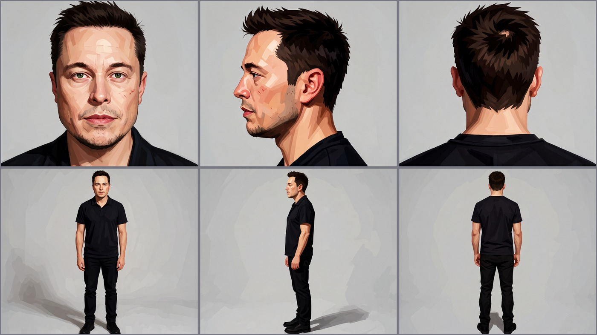
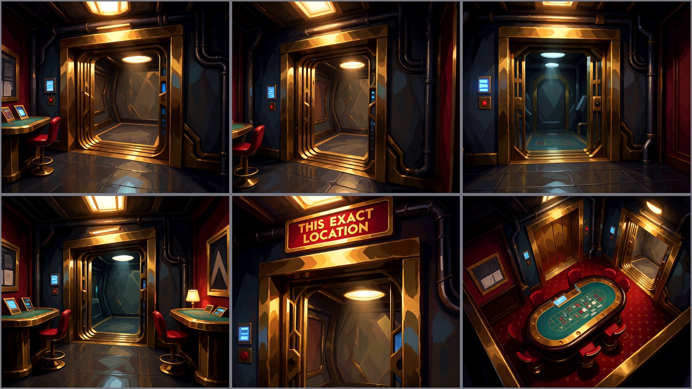
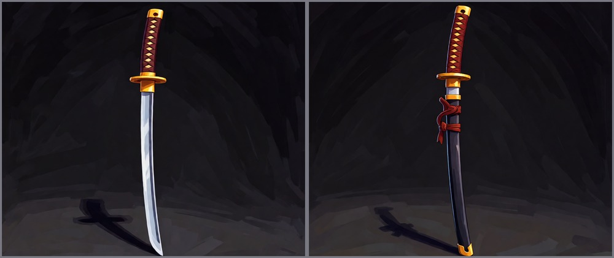
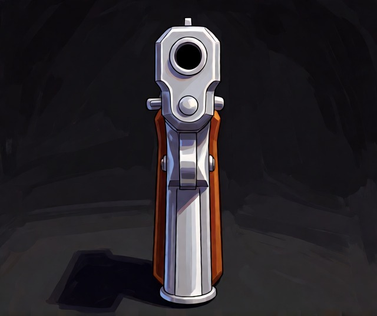

# Split Node

AI documentary generator. Turns "beat the system" news stories (hacks, lottery wins, loopholes, scams) into ~25-minute 1080p (or 4K) documentaries in the FERN / Black Files style - with LLM-written narration scripts and shot lists, a full cast of AI characters with consistent faces, stylized locations and props, voice-cloned narration, cinematic music and SFX, and burned-in chapter cards. Headless: RSS in, rendered and uploaded episode out.

## Features

- **Script generation** - two-stage LLM: Stage 1 writes the narration script (target ~115 paragraphs / ~25 min), Stage 2 writes a shot list for every beat with camera logic (EWS / WS / MS / CU / ECU), angles and character prompts
- **Director's bible** - before any image is made, the LLM plans the episode: deeper problem, protagonist transformation, chapter moods, hero paragraphs for close-up magnification
- **Cast likeness system** - 20 fixed metahuman archetypes with exact clothing prompts; real-photo reference search (SerpAPI + Openverse) with local vision audit for authentic character faces
- **Individual character panels** - every character gets SIX separate 1280x1280 reference panels (face, face-side, face-back, body-front, body-side, body-back), no grid merge. Each shot picks the *perfect* panel for its framing - wide shots use a body panel, close-ups use a face panel, side/back refs are auto-mirrored to match which way the person faces, and multi-person shots use one panel per character (they can mismatch: face for one, body for another). A close-up of a hand or object gets no person ref at all
- **Multi-character shots** - the shot list can name several people (comma-separated); each is described from its archetype and referenced with its own panel
- **Selectable style profiles** - 8 built-in visual styles (`arcane`, `bold-outline`, `artsy`, `photoreal`, `noir`, `synthwave`, `editorial`, `watercolor`) pickable with `STYLE=<name>`. The selected style is injected into every prompt as TEXT (no style image refs). Add your own anytime and it persists for future runs
- **Style prompt injection, no training** - the channel style is injected as text into every shot, character panel, location and prop prompt, so there are no style-plate references and no reference-copy bug. A resume keeps the exact style the episode was generated with
- **Locations & props** - 6-panel location sheets per environment (establishing / front-left / front-right / interior / detail / overhead), front+back prop assets; specific real-world props get a SerpAPI reference photo
- **Brand & AI logos** - when the article talks about a real business or AI company (OpenAI, ChatGPT, Gemini, Claude...), its logo is fetched from the official source (Wikimedia Commons, 36 brands pre-mapped) with SerpAPI as fallback, cached and re-used forever; entity talk renders a hacker-style computer screen (prop sheet + logo), HQ talk renders the logo on a building (location sheet + logo), and business-building locations get the logo baked into their sheet
- **Local rendering** - Krea 2 Turbo in ComfyUI (RTX 3070, --lowvram), PocketTTS cloned narration voice, music beds (suspense crossfading into triumphant), 130+ SFX library with hit-aligned timing
- **Chapters & titles** - 10 duration-aligned chapter breaks with Bahnschrift chapter cards (glow-pop), typewriter location/person cards
- **B-roll cache** - reusable no-character shots keyed by scene keywords
- **Trend scoring toolkit** - SerpAPI + YouTube competition analysis to pick topics with demand
- **Resume-safe** - every stage skips already-completed work, persistent batch clips
- **4K output ready** - every shot is upscaled in-graph with 4x-FaceUpDAT, and you choose the final resolution: **1080p or 4K** - it drives both the image upscale target and the FFmpeg video output
- **YouTube upload + Discord announcements**

## The look

The channel style is now a selectable **style profile** - a plain-text descriptor that is injected into every prompt (shots, character panels, locations, props). No style image refs, no LoRA training, no reference-copy bug.

Pick a built-in with the `STYLE` env var, or add your own:

```
STYLE=arcane python system_breakers.py          # default channel look
STYLE=bold-outline python system_breakers.py
STYLE=noir python system_breakers.py
python system_breakers.py --list-styles          # show every selectable style
python system_breakers.py --add-style vhs "<style descriptor text>"   # add + persist
python system_breakers.py --remove-style vhs     # remove a custom style
```

Built-ins: `arcane` (default), `bold-outline`, `artsy`, `photoreal`, `noir`, `synthwave`, `editorial`, `watercolor`. Custom styles persist in `style_sheets/custom_styles.json` and become selectable on every future run. When you resume an episode it keeps the exact style it was generated with (unless you override with `STYLE=`).

## How it works

### 1. Story discovery

RSS "beat the system" stories (hack / lottery / loophole keywords) -> article -> junk filtering -> LLM relevance scoring (0-10, off-topic beats discarded). A trend scoring toolkit (SerpAPI + YouTube competition analysis) helps pick topics with actual demand.

### 2. Script generation

Four LLM passes build the plan before a single image is made:

- **Director's bible** - deeper problem, transformation arc, chapter moods, hero paragraphs (ECU magnification candidates)
- **Episode world** - works for any topic / environment / location
- **Scene board** - one storyboard card per narration beat, saved to the episode folder for human review before generation
- **Stage 1 - narration script** - each article paragraph is expanded into multiple narration paragraphs (target ~115 total), with covered-beat dedupe and a strict OUTPUT CONTRACT (raw narration only, no meta text)
- **Stage 2 - shot list** - every narration paragraph gets a shot entry: character archetype, camera logic (EWS / WS / MS / CU / ECU), angle, action, which way the character faces, SFX category; chapter paragraphs become black cards
- **Chapter breaks** - 10 duration-aligned breaks estimated from word counts, LLM-written chapter titles
- **Style test frame** - a Krea 2 test frame is generated and human-reviewed before the run commits; reject it and the bible is rebuilt with a fresh perspective

### 3. Cast & likeness

Every named character maps to one of 20 metahuman archetypes (role / gender / age matching, everyman fallback). For real-world subjects, a real photo is found via SerpAPI (Openverse fallback) and audited locally (person + text/logo/watermark checks), then fed through the Krea 2 identity chain to produce **six individual 1280x1280 reference panels** (no grid merge):



Identity prompts are view-descriptions only plus the selected style injected as text - embedding long style blocks in identity prompts flips the model into copy mode and breaks likeness. Grounding is tuned (768px) to prevent duplicate figures.

### 3b. Panel selection per shot

For each shot the pipeline discovers which panel(s) to reference from the framing and the scene text:

- **wide shot** -> body panel; **close-up** -> face panel
- **facing left** -> side panel as-is; **facing right** -> the side panel is **mirrored** before generating; **from behind / back** -> back panel
- **close-up of a hand / object / prop** -> no person ref at all (pure text-to-image)
- **multiple people** -> one panel per character (they can mismatch: face for one, body for another, different facing each)
- **business HQ / interior shot** -> the real brand logo is added as a ref alongside the character panel(s)

### 4. Locations & props

Each unique place in the episode gets a 6-panel location sheet - establishing, front-left, front-right, interior, detail, overhead:



Props are generated front + back. Generic props (katana, pistol, lantern, book, chess set) are pure text-to-image with the style plate; specific real-world props (brands, models, digits, proper nouns) get a SerpAPI reference photo plus the style plate:

 

### 5. Brands & AI logos

When the article talks about a real business or AI company, the pipeline notices and does three things:

1. **Detect** - a curated AI registry (OpenAI, ChatGPT, Gemini, Claude, Midjourney, NVIDIA...) plus an LLM pass that extracts any other real businesses from the article, each classified as `screen` (entity/product talk) or `building` (HQ / offices / factory / physical location talk)
2. **Cache the official logo** - official source first: 36 brands are pre-mapped to their Wikimedia Commons logo (rasterized PNG, so it is always the real mark), SerpAPI image search (Openverse fallback) only covers brands not in that registry. Cache-first: once downloaded, it is reused on every future episode - zero repeat searches
3. **Render the context-appropriate asset**:
   - entity/product talk -> hacker-style computer screen: dark terminal, green code streams, the real logo centered on the monitor (prop style sheet + logo as refs)
   - HQ / physical location talk -> the logo on a building: glowing facade sign at night (location style sheet + logo as refs)
   - location sheet IS a business building (e.g. "OpenAI headquarters") -> the logo joins that location sheet's refs so it appears inside the building

Matching shots then reference these pre-styled brand assets, so a story about an AI startup shows its actual logo on screen, and a story about a company's HQ shows the building wearing it.

Pre-cache logos anytime without a full run:

```
python system_breakers.py --cache-logos OpenAI Claude Tesla
```

### 6. From panel to screen

Each shot is generated straight to the selected output resolution (1080p by default, 4K if chosen - in-graph 4x-FaceUpDAT upscale) from a text prompt + the selected style injected, with the discovered reference panel(s) locking character identity and any brand logo locking the business mark. This is the pipeline's core promise: one set of character panels, one style, any number of consistent shots - face-locked, angle-aware and facing-aware:


### 7. Voice, music & SFX

- **Voice** - cloned narration voice via PocketTTS (0dB normalized), generated in parallel with image generation
- **Music** - one continuous bed: suspense for the first 65%, crossfading (2s) into triumphant, mixed at -18dB
- **SFX** - 130+ cinematic sounds pre-analyzed for build / hit / decay times, hit-aligned at -14dB; camera shutter at -4dB; every video opens with a glitchy suspense hit

### 8. Render & titles

hevc_nvenc at the selected resolution (1080p or 4K) with stream-copy concat and +faststart. Chapter cards ("CHAPTER N" kicker + title, Bahnschrift with glow-pop) and typewriter location/person cards (Consolas) are burned in via the ASS title engine. Pick the output resolution with the `RESOLUTION` env var or the startup prompt (`RESOLUTION=4k` / `RESOLUTION=1080p`); it is persisted to resume state so a resumed episode keeps the same output size.

### 9. Upload

YouTube upload (native scheduling, per-channel credentials) + Discord announcement with description, hype wrap and link.

## Requirements

- Python 3.11+
- LM Studio on localhost:1234
- ComfyUI with Krea 2 Turbo (identity / asset / shot pipeline)
- PocketTTS server on 127.0.0.1:8769
- FFmpeg with hevc_nvenc (NVIDIA)
- SerpAPI key for real-photo references + trend scoring - set `SERPAPI_API_KEY=...` in `.env`
- YouTube OAuth: `client_secret_*.json` + `oauth_split_node.py`

## Usage

| Command | Purpose |
|---------|---------|
| `SystemBreakers.bat` | Run the full pipeline (story -> upload) |
| `system_breakers.py` | Main pipeline script |
| `krea2_splitnode.py` | Local Krea 2 Turbo image generation (identity / assets / shots) |
| `cast_likeness.py` | Build cast likeness references (`--one hacker` / `--all`) |
| `build_style_sheet.py` | Build the channel style reference sheet |
| `build_asset_style_sheets.py` | Build location / prop style sheets |
| `generate_broll_cache.py` | Pre-generate the b-roll asset cache |
| `split_node_titles.py` | Chapter / title ASS engine |
| `analyze_sfx.py` | Analyze SFX library (build / hit / decay times) |
| `trend_scorer.py` | Score topic ideas (demand / room / trajectory) |
| `upscale_4k.py` | Optional standalone SPAN 4x upscaler (not used by the pipeline - shots upscale in-graph via 4x-FaceUpDAT) |
| `mini_test.py` | End-to-end pipeline test |
| `--cache-logos OpenAI Claude` | Pre-cache brand logos without a full run |
| `STYLE=noir system_breakers.py` | Generate with a selected style profile |
| `RESOLUTION=4k system_breakers.py` | Render at 4K (image upscale + final video); default 1080p |
| `--list-styles` | List every selectable style profile |
| `--add-style <name> "<desc>"` | Add a custom style (persists for future runs) |
| `--remove-style <name>` | Remove a custom style |
| `oauth_split_node.py` | YouTube OAuth authorization |

## Project layout

| Path | Purpose |
|------|---------|
| `shots/` `rendered_audio/` `rendered_video/` `thumbnails/` | Stage outputs (gitignored) |
| `cinematic_sounds/` | SFX library |
| `style_sheets/` `style_refs/` | Style profiles + `custom_styles.json` + reference assets |
| `style_previews/` | Per-style preview panels (one per selectable style) |
| `cast_refs/` | Cast likeness images (`cast_refs/real/` + `cast_refs/logos/` gitignored) |
| `image-assets/` | Generated caches: b-roll, brand screens, brand buildings (gitignored) |
| `docs/images/` | README showcase images |
| `voice_refs/` | TTS narration voice clone reference |
| `.env` | API keys (gitignored - never commit) |

## Notes

- Episodes numbered (epNNN), per-episode shot folders under `shots/epN/`
- AI-generated content disclaimer included on uploads
- Winning episode formula (bible + template) is saved for reuse on future episodes
