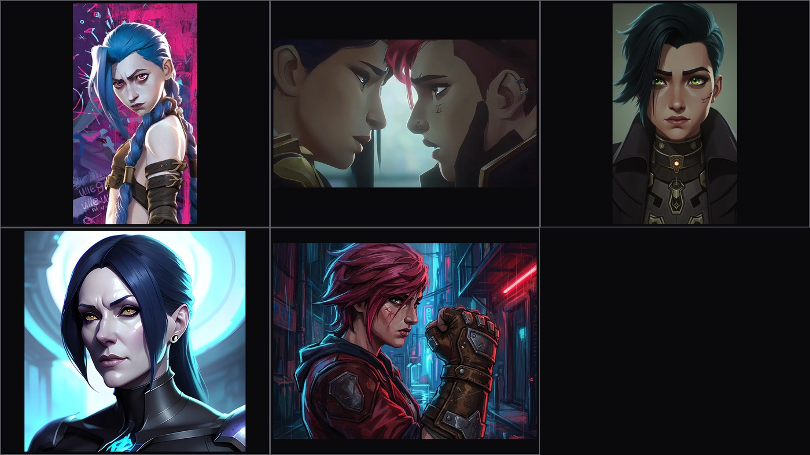

# Split Node

AI documentary generator. Turns "beat the system" news stories (hacks, lottery wins, loopholes, scams) into ~25-minute 1080p documentaries in the FERN / Black Files style - with LLM-written narration scripts and shot lists, a full cast of AI characters with consistent faces, stylized locations and props, voice-cloned narration, cinematic music and SFX, and burned-in chapter cards. Headless: RSS in, rendered and uploaded episode out.

## Features

- **Script generation** - two-stage LLM: Stage 1 writes the narration script (target ~115 paragraphs / ~25 min), Stage 2 writes a shot list for every beat with camera logic (EWS / WS / MS / CU / ECU), angles and mannequin prompts
- **Director's bible** - before any image is made, the LLM plans the episode: deeper problem, protagonist transformation, chapter moods, hero paragraphs for close-up magnification
- **Cast likeness system** - 20 fixed metahuman archetypes with exact clothing prompts; real-photo reference search (SerpAPI + Openverse) with local vision audit for authentic character faces
- **Krea 2 identity chains** - 6-panel character sheets (face, face-side, face-back, body-front, body-side, body-back) chained through a reference-image LoRA, so the same character keeps the same face across every shot
- **Style chain, no training** - reference style sheets define the channel look (style-transfer-only prompts); the style plate styles the assets, and shots reference only the pre-styled assets
- **Locations & props** - 6-panel location sheets per environment (establishing / front-left / front-right / interior / detail / overhead), front+back prop assets; specific real-world props get a SerpAPI reference photo
- **Brand & AI logos** - when the article talks about a real business or AI company (OpenAI, ChatGPT, Gemini, Claude...), its logo is fetched from the official source (Wikimedia Commons, 36 brands pre-mapped) with SerpAPI as fallback, cached and re-used forever; entity talk renders a hacker-style computer screen (prop sheet + logo), HQ talk renders the logo on a building (location sheet + logo), and business-building locations get the logo baked into their sheet
- **Local rendering** - Krea 2 Turbo in ComfyUI (RTX 3070, --lowvram), PocketTTS cloned narration voice, music beds (suspense crossfading into triumphant), 130+ SFX library with hit-aligned timing
- **Chapters & titles** - 10 duration-aligned chapter breaks with Bahnschrift chapter cards (glow-pop), typewriter location/person cards
- **B-roll cache** - reusable no-character shots keyed by scene keywords
- **Trend scoring toolkit** - SerpAPI + YouTube competition analysis to pick topics with demand
- **Resume-safe** - every stage skips already-completed work, persistent batch clips
- **4x upscaling** - SPANkendata upscaler (bf16, streaming RGB frames to GPU)
- **YouTube upload + Discord announcements**

## The look

The channel look comes from reference style sheets, not LoRA training. The style sheet below (Arcane-inspired) is the single source of truth for the visual style - it styles every character, location and prop asset.



Style-transfer-only prompts are used throughout: *"Use ONLY the painting and render style from the reference artwork. Reference images show DIFFERENT scenes - this panel is X and NOTHING else."* Assets get styled; shots then use only the styled assets as references (the plate never appears in a shot).

## How it works

### 1. Story discovery

RSS "beat the system" stories (hack / lottery / loophole keywords) -> article -> junk filtering -> LLM relevance scoring (0-10, off-topic beats discarded). A trend scoring toolkit (SerpAPI + YouTube competition analysis) helps pick topics with actual demand.

### 2. Script generation

Four LLM passes build the plan before a single image is made:

- **Director's bible** - deeper problem, transformation arc, chapter moods, hero paragraphs (ECU magnification candidates)
- **Episode world** - works for any topic / environment / location
- **Scene board** - one storyboard card per narration beat, saved to the episode folder for human review before generation
- **Stage 1 - narration script** - each article paragraph is expanded into multiple narration paragraphs (target ~115 total), with covered-beat dedupe and a strict OUTPUT CONTRACT (raw narration only, no meta text)
- **Stage 2 - shot list** - every narration paragraph gets a shot entry: mannequin archetype, camera logic (EWS / WS / MS / CU / ECU), angle, action, SFX category; chapter paragraphs become black cards
- **Chapter breaks** - 10 duration-aligned breaks estimated from word counts, LLM-written chapter titles
- **Style test frame** - a Krea 2 test frame is generated and human-reviewed before the run commits; reject it and the bible is rebuilt with a fresh perspective

### 3. Cast & likeness

Every named character maps to one of 20 metahuman archetypes (role / gender / age matching, everyman fallback). For real-world subjects, a real photo is found via SerpAPI (Openverse fallback) and audited locally (person + text/logo/watermark checks), then fed through the Krea 2 identity chain to produce a consistent 6-panel character sheet:


Identity prompts are view-descriptions only - embedding style text in identity prompts flips the model into copy mode and breaks likeness. Grounding is tuned (768px) to prevent duplicate figures.

### 4. Locations & props

Each unique place in the episode gets a 6-panel location sheet - establishing, front-left, front-right, interior, detail, overhead:


Props are generated front + back. Generic props (katana, pistol, lantern, book, chess set) are pure text-to-image with the style plate; specific real-world props (brands, models, digits, proper nouns) get a SerpAPI reference photo plus the style plate:

 

### 5. Brands & AI logos

When the article talks about a real business or AI company, the pipeline notices and does three things:

1. **Detect** - a curated AI registry (OpenAI, ChatGPT, Gemini, Claude, Midjourney, NVIDIA...) plus an LLM pass that extracts any other real businesses from the article, each classified as `screen` (entity/product talk) or `building` (HQ / offices / factory / physical location talk)
2. **Cache the official logo** - official source first: 36 brands are pre-mapped to their Wikimedia Commons logo (rasterized PNG, so it is always the real mark), SerpAPI image search (Openverse fallback) only covers brands not in that registry. Cache-first: once downloaded, it is reused on every future episode - zero repeat searches
3. **Render the context-appropriate asset**:
   - entity/product talk -> hacker-style computer screen: dark terminal, green code streams, the real logo centered on the monitor (prop style sheet + logo as refs)
   - HQ / physical location talk -> the logo on a building: glowing facade sign at night (location style sheet + logo as refs)
   - location sheet IS a business building (e.g. "OpenAI headquarters") -> the logo joins that location sheet's refs so it appears inside the building

Matching shots then reference these pre-styled brand assets, so a story about an AI startup shows its actual logo on screen, and a story about a company's HQ shows the building wearing it.

Pre-cache logos anytime without a full run:

```
python system_breakers.py --cache-logos OpenAI Claude Tesla
```

### 6. From sheet to screen

Shots reference the pre-styled assets only - face panel, location sheet, prop asset, b-roll - angle-matched and face-locked. This is the pipeline's core promise: one character sheet, one location sheet, any number of consistent shots:


### 7. Voice, music & SFX

- **Voice** - cloned narration voice via PocketTTS (0dB normalized), generated in parallel with image generation
- **Music** - one continuous bed: suspense for the first 65%, crossfading (2s) into triumphant, mixed at -18dB
- **SFX** - 130+ cinematic sounds pre-analyzed for build / hit / decay times, hit-aligned at -14dB; camera shutter at -4dB; every video opens with a glitchy suspense hit

### 8. Render & titles

1080p hevc_nvenc with stream-copy concat and +faststart. Chapter cards ("CHAPTER N" kicker + title, Bahnschrift with glow-pop) and typewriter location/person cards (Consolas) are burned in via the ASS title engine.

### 9. Upload

YouTube upload (native scheduling, per-channel credentials) + Discord announcement with description, hype wrap and link.

## Requirements

- Python 3.11+
- LM Studio on localhost:1234
- ComfyUI with Krea 2 Turbo (identity / asset / shot pipeline)
- PocketTTS server on 127.0.0.1:8769
- FFmpeg with hevc_nvenc (NVIDIA)
- SerpAPI key for real-photo references + trend scoring - set `SERPAPI_API_KEY=...` in `.env`
- YouTube OAuth: `client_secret_*.json` + `oauth_split_node.py`

## Usage

| Command | Purpose |
|---------|---------|
| `SystemBreakers.bat` | Run the full pipeline (story -> upload) |
| `system_breakers.py` | Main pipeline script |
| `krea2_splitnode.py` | Local Krea 2 Turbo image generation (identity / assets / shots) |
| `cast_likeness.py` | Build cast likeness references (`--one hacker` / `--all`) |
| `build_style_sheet.py` | Build the channel style reference sheet |
| `build_asset_style_sheets.py` | Build location / prop style sheets |
| `generate_broll_cache.py` | Pre-generate the b-roll asset cache |
| `split_node_titles.py` | Chapter / title ASS engine |
| `analyze_sfx.py` | Analyze SFX library (build / hit / decay times) |
| `trend_scorer.py` | Score topic ideas (demand / room / trajectory) |
| `upscale_4k.py` | SPAN 4x upscaler |
| `mini_test.py` | End-to-end pipeline test |
| `--cache-logos OpenAI Claude` | Pre-cache brand logos without a full run |
| `oauth_split_node.py` | YouTube OAuth authorization |

## Project layout

| Path | Purpose |
|------|---------|
| `shots/` `rendered_audio/` `rendered_video/` `thumbnails/` | Stage outputs (gitignored) |
| `cinematic_sounds/` | SFX library |
| `style_sheets/` `style_refs/` | Krea 2 style reference assets |
| `cast_refs/` | Cast likeness images (`cast_refs/real/` + `cast_refs/logos/` gitignored) |
| `image-assets/` | Generated caches: b-roll, brand screens, brand buildings (gitignored) |
| `docs/images/` | README showcase images |
| `voice_refs/` | TTS narration voice clone reference |
| `.env` | API keys (gitignored - never commit) |

## Notes

- Episodes numbered (epNNN), per-episode shot folders under `shots/epN/`
- AI-generated content disclaimer included on uploads
- Winning episode formula (bible + template) is saved for reuse on future episodes
